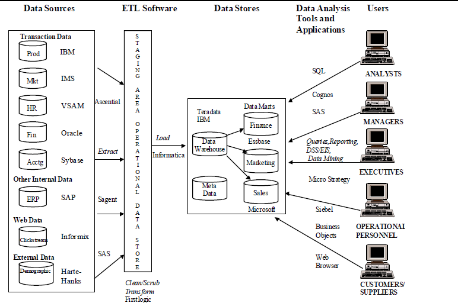

# Data Warehouse

A Data Warehouse (DW) is defined in many different ways, but not rigorously.

* A decision support database that is maintained separately from the organization’s operational database
* Data warehouse is also viewed as an architecture, constructed by integrating data from multiple heterogeneous sources to support structured and/or adhoc queries, analytical reporting and decision making.

Data Warehousing is the process of constructing and using data warehouses.

## Characteristics of Data Warehouse

* **Subject-oriented** : customer, product, sales.
* **Integrated** : relational databases, flat files, on-line transaction records
* **Time-variant** : provide information from a historical perspective (past 5-10 years)
* **Non-volatile** : initial loading of data and access of data .
* Summarized
* Not normalized
* Metadata
* Web based, relational/multi-dimensional
* Client/server
* Real-time and/or right-time (active)

## Importance of Data Warehousing

* Provide a “single version of the truth”
* Improve decision making
* Support key corporate initiatives such as performance management, B2C and B2B ecommerce, and customer relationship management

## Warehouse Users

* Analysts
* Managers
* Executives
* Operational personnel
* Customers and suppliers

## Operational Data Store

* An operational data store consolidates data from multiple source systems and provides a near realtime, integrated view of volatile, current data.
* Its purpose is to provide integrated data for operational purposes. It has add, change, and delete functionality.
* It may be created to avoid a full blown ERP implementation.

## Data Warehouse vs. Operational DBMS

* Major task of traditional relational DBMS is **OLTP (On-line Transaction Processing)**
  * Day-to-day operations: purchasing, inventory, accounting, etc.
* Major task of data warehouse system is **OLAP (On-line Analytical Processing)**
  * Data analysis and decision making

## Variants of Data Warehouse

* **Operational data stores (ODS)** : A type of database often used as an interim area for a data warehouse.
* **Oper marts** : An operational data mart.
* **Enterprise data warehouse (EDW)** : A data warehouse for the enterprise.
* **Metadata** : Data about data. In a data warehouse, metadata describe the contents of a data warehouse and the manner of its acquisition and use.

### Data Mart

A departmental data warehouse that stores only relevant data

* **Dependent data mart** : A subset that is created directly from a data warehouse.
* **Independent data mart** : A small data warehouse designed for a strategic business unit or a department.

## Data Warehouse Framework

## Data Warehouse Architecture

* **Three-tier architecture**
  * Data acquisition software (back-end) (DB Layer)
  * The data warehouse that contains the data & software (Application Layer)
  * Client (front-end) software that allows users to access and analyze data from the warehouse (Client Layer)

* **Two-tier architecture**
  * First 2 tiers in three-tier architecture is combined into one (DB + Application Layer combined)

### Web-based DW Architecture

### Alternative DW Architecture

### Factors affecting selection of DW Architure

1. Information interdependence between organizational units
2. Upper management’s information needs
3. Urgency of need for a data warehouse
4. Nature of end-user tasks
5. Constraints on resources
6. Strategic view of the data warehouse prior to implementation
7. Compatibility with existing systems
8. Perceived ability of the in-house IT staff
9. Technical issues
10. Social/political factors

## Extraction, Transformation and Load (ETL) Process

### Issues affecting the purchase of ETL tool

* ETL tools are expensive
* ETL tools may have a long learning curve

### Important criteria in selecting an ETL tool

* Ability to read from and write to an unlimited number of data sources/architectures
* Automatic capturing and delivery of metadata
* A history of conforming to open standards
* An easy-to-use interface for the developer and functional user

### Sample ETL Tools

* Teradata Warehouse Builder from Teradata
* DataStage from Ascential Software
* SAS System from SAS Institute
* Power Mart/Power Center from Informatica

## Benefits of DW

* **Direct benefits of a data warehouse**
  * Allows end users to perform extensive analysis
  * Allows a consolidated view of corporate data
  * Better and more timely information
  * Enhanced system performance
  * Simplification of data access

* **Indirect benefits of data warehouse**
  * Enhance business knowledge
  * Present competitive advantage
  * Enhance customer service and satisfaction
  * Facilitate decision making
  * Help in reforming business processes

## DW Development Approaches

## DW Structures

### Star Schema (Dimensional Modelling)

### Data cube

A two-dimensional, three-dimensional, or higher-dimensional object in which each
dimension of the data represents a measure of interest

* Grain
* Drill-down
* Slicing

## Best Practices for Implementing DW

Implementation of the DW can be In-house or Outsourced. Each strategy has its advantage and disadvantage.

* The project must fit with corporate strategy
* There must be complete buy-in to the project
* It is important to manage user expectations
* The data warehouse must be built incrementally
* Adaptability must be built in from the start
* The project must be managed by both IT and business professionals
* Only load data that have been cleansed/high quality
* Do not overlook training requirements
* Be politically aware

## Real-time DW ( Active Data Warehousing )

* Enabling real-time data updates for real-time analysis and real-time decision making is growing rapidly
  * Push vs. Pull (of data)
* Concerns about real-time BI
  * Not all data should be updated continuously
  * Mismatch of reports generated minutes apart
  * May be cost prohibitive
  * May also be infeasible

## Data Warehouse Administration

* Due to its huge size and its intrinsic nature, a DW requires especially strong monitoring in order to sustain its efficiency, productivity and security.
* The successful administration and management of a data warehouse entails skills and proficiency that go past what is required of a traditional database administrator.
* Requires expertise in high-performance software, hardware, and networking technologies.

## DW Scalability and Security

### Scalability

* Good scalability means that queries and other data-access functions will grow linearly with the size of the warehouse
* The main issues pertaining to scalability:
  * The amount of data in the warehouse
  * How quickly the warehouse is expected to grow
  * The number of concurrent users
  * The complexity of user queries

### Security

* Emphasis on security and privacy

## Further Information

* <http://www.olapreport.com> (provides detailed information about the OLAP market, products, and applications)
* <http://www.firstlogic.com> (includes an interactive demo of their data cleansing tool)
* <http://www.billinmon.com> (a wealth of current information from “the father of data warehousing”)
* <http://www.metagenix.com> (illustrates recent advances in ETL tools)
* <http://www.microstrategy.com> (excellent materials from one of the leading DSS vendors)
