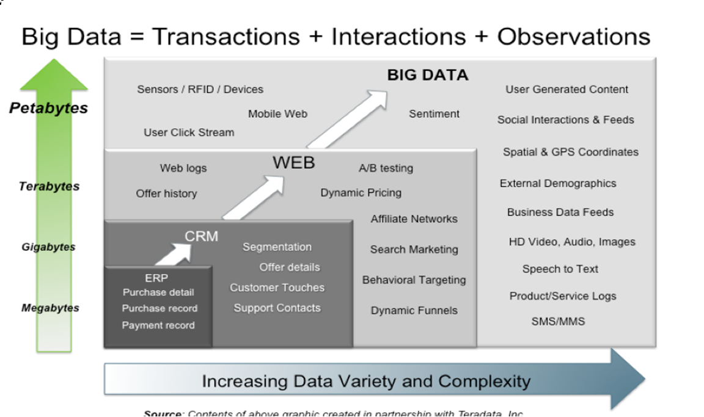
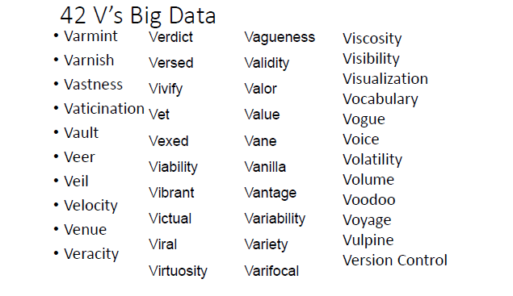
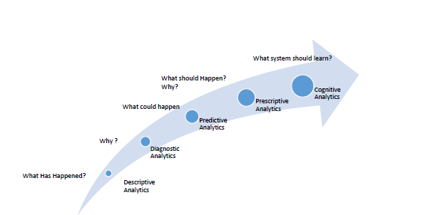
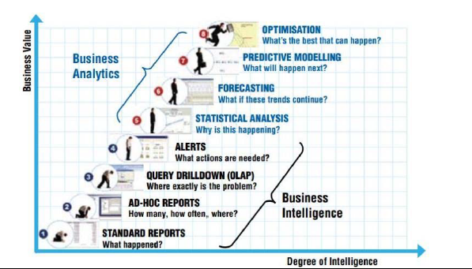
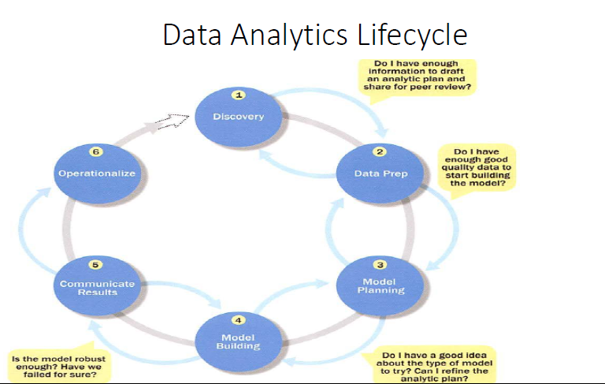

# Data and Analytics

There is abundance of data nowadays. Every Company is a data company.

## Types of Financial Data

### Fundamental Data

* It is mostly accounting data reported quarterly. Ex: Data on the company assets,accounts payables,and liabilities.
* Fundamental data is reported with a lapse
* Fundamental data is extremely regularized and low frequency (timed).

### Market Data

* It includes all the trading activity that takes place in an exchange or trading venue.
* It is abundant, with over 10TB being generated daily.
* Study of this data can help you anticipate the competitor's next move.

### Analytical Data

* Also referred to as derivative data based on an original source, which could be fundamental, market or alternative or even a collection of other analytics.
* This type of data is not readily available from an original source, it has been processed for you in a particular way.
* For example, Investments banks sell valuable information that result from in‐depth analyses of companies.

### Alternative Data

* The next type of data often used in finance is information gathered from non‐traditional information sources.
* The Analysis of alternative data can provide insights beyond that which an industry's regular data sources can provide.

## Big Data

### Big Data Sources

* All online activities
* User Generated (Mobile and Web) data
* IOT
* Health/Scientific Computing

### 3 V's of Big Data

* **Volume** provides the amount of data the form of data.
* **Velocity** provides the time at which the data is collected and analyzed.
* **Variety** provides the type of data Collected.

This has been extended to a great extent!

## Analytics

### Time Line for Data Analysis

1. 1935 : Design of Experiments
2. 1955 : Business Intelligence Systems
3. 1977 : Exploratory Data Analysis
4. 1997 : Machine Learning

### Types of Analytics

### Levels of Analytics

### Analytical Techniques

* Correlation analysis
* Association Rule
* Classification
* Regression
* Clustering
* Prediction
* Segmentation

### Data Analytics Process

### Data Analytics Lifecycle

