# Data Warehousing and OLAP

## Retail Case Study

* Large grocery chain: 100 grocery stores over 10regions
* Each store:
  * Departments: grocery, frozen foods, dairy, meat, produce, bakery etc.
  * 60,000 products (SKUs = stock keeping units) on shelves
  * 55,000 SKUs with UPCs
  * 5,000 SKUs without UPCs but with assigned SKU numbers
* Data is collected:
  * from cash registers into a point‐of‐sale (POS) system
  * at back door where vendors make deliveries

### Retail Sales Questions

* What is the **lift** due to a promotion?
  * Lift = gain in sales in a product because it’s being promoted
  * Requires estimated baseline sales value
  * Could be calculated based on historical sales figures
* Detect **time shifting**
  * Customers stock up on the product that’s on sale
  * Then they don’t buy more of it for a long time
* Detect **cannibalization**
  * Customers buy the promoted product instead of competing products
  * Promoting Brand A reduces sales of Brand B
* Detect **cross‐sell** of complementary products
  * Promoting charcoal increases sales of lighter fluid
  * Promoting hamburger meat increases sales of hamburger buns
* What is the **profitability** of a promotion?
  * Considering promotional costs, discounts, lift, time shifting, cannibalization, and cross‐sell

## Four Step Dimensional Design Process

1. Select the business process to model (not business department or function )
   * E.g. purchasing, ordering, shipping, invoicing
   * Case study Business Process: **POS retail sales**
   * The first dimensional model built should be the one
     * with the most impact,
     * that answers the most pressing business questions,
     * is readily accessible for data extraction.

2. Declare the grain of the business process
   * This consitutues each fact table.
   * Choose the most atomic information captured by the business process.
   * **Atomic data**
     * Most detailed, cannot be subdivided
     * Facilitates ad hoc, unexpected usage and ability to drill down to details
   * Case study grain: individual line item on a POS transaction Specifies individual fact table row

3. Choose the dimensions that apply for each fact table row.
   * It is usually possible to add addtoinal dimensions later.
   * If an additional desired dimension violates the grain by causing additional fact rows to be generated, then the grain statement must be revised to accommodate this dimension.
   * Case study dimensions: date, product, store, promotion

4. Identify the numeric (measured) facts that will populate each fact table row.
   * Case study ‐ Facts collected by POS system:
     * Sales quantity, sales price/unit, sales $ amount, standard cost $amount
     * Gross Profit = cost – sales
   * For non‐additive measurements such as percentages and ratios (e.g.,gross margin) store the numerator (gross profit) and denominator ($revenue) in the fact table. The ratio can be calculated in a dataaccess tool for any slice of the fact table. **Caution**: Calculate the ratio of the sums, not the sum of the ratios

### Factness Fact Table

* A Factless Fact table has no measurement metrics.
* It can be created for eg. to find the Products under promotion but which did not sell.

### Degenerate Dimension (DD)

* Dimension keys used in fact table without corresponding dimension tables
* Still useful for grouping by transaction
* Common DDs: order numbers, invoice numbers
* In case study: POS Transaction #

### Too Many Dimensions

* Too many dimensions increase space requirements for the fact table.
* A very large number of dimensions typically means that several dimensions are not completely independent and should be combined.
* A single hierarchy should not be captured in separate dimensions.

## On‐line Analytical Processing (OLAP)

* A set of functionality that facilitates multidimensional analysis
* Allows users to analyze data in ways that are natural to them
* Comes in many varieties ‐‐ ROLAP, MOLAP, DOLAP, etc.

## Conceptual Modeling of Data Warehouses

### Star Schema

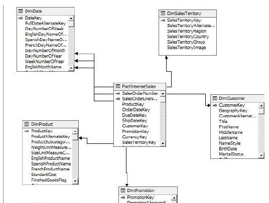

### Snowflake Schema

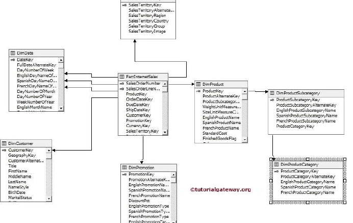

### Fact Constellation Schema

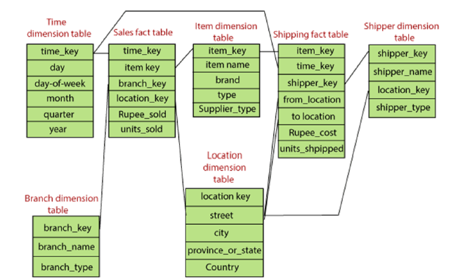

## Roll Up Operation

* Also called **Drill up operation**.
* Performs aggregation on data cube either by climbing up a concept hieracy for a dimension or by dimension reduction.

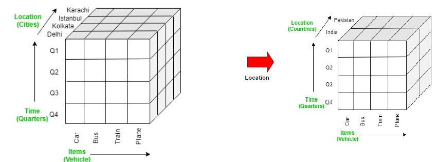

### Dimension Hierarchies

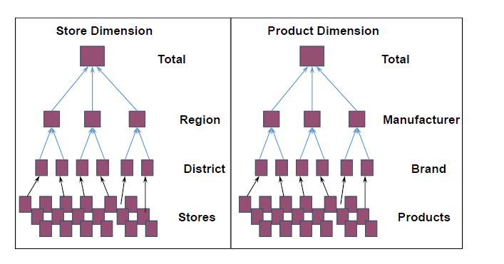

## Drill Down Operation

* Reverse of roll up operation
* Less detailed data to more detailed data
* Stepping down a concept hierarchy or introducing the new dimensions

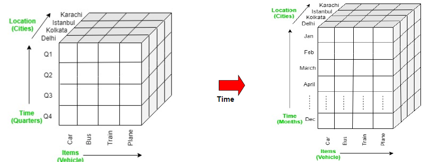

## Slice Operation

* Selection on one dimension of the given cube, resulting in a sub cube

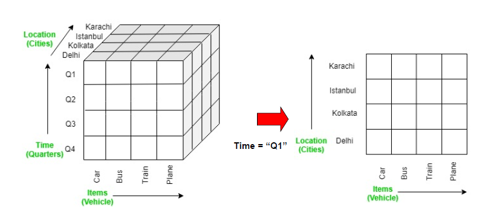

## Dice Operation

* It selects a sub-cube from the OLAP cube by selecting two or more dimensions

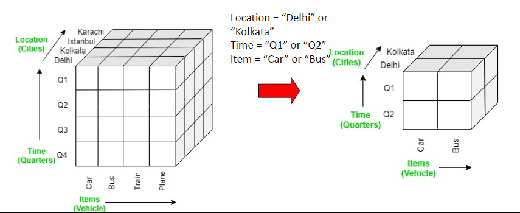

## Pivot

* It is also known as rotation operation as it rotates the current view to get a new view of the representation.

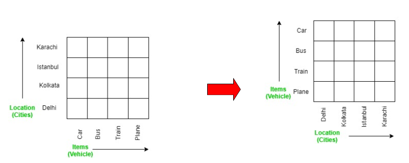

## Date Lake

* The data lake consolidates an organization’s data into a governed and well‐managed environment that supports both analytics development and production workloads.
* It embraces multiple data platforms, such as relational data warehouses, Apache Hadoop clusters, and analytical appliances, and manages them together through a common governance program.

## Drivers of Data Lake

### Business need

* Improving trust in data, for organizations where many decisions are made on gut feeling due to a lack of trust in the data presented
* The need for self‐service business intelligence (BI), where new tools allow business users to produce smart reports quickly
* The need for advanced analytics, where new types of analytics demand a new approach on how to organize data of all types from both inside and outside of the organization

### Technical need

* **Complexity reduction:** Over the years the analytical landscape might have become complex with numerous data warehouses and data marts with complex sets of interfaces. To provide agility and flexibility, these environments need to be aligned and made more consistent.
* **Cost efficiency:** Complex IT landscapes need to become more efficient and cheaper to run and maintain.
* **Transparency:** An ever‐increasing regulatory pressure required a new approach on how to manage data and demanded an analytical platform that had governance by design.
* **New sources of data:** Existing structures of data were not ready for new semi and unstructured data sources. Heterogeneous information virtualization is required to provisioning data in a simple way to the consumer.

## Data Lake Logical View

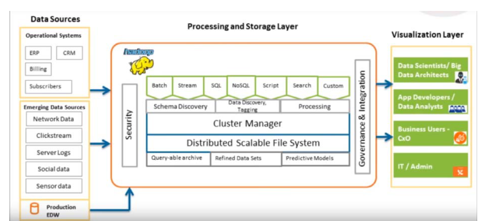

## Data Lake Workflow

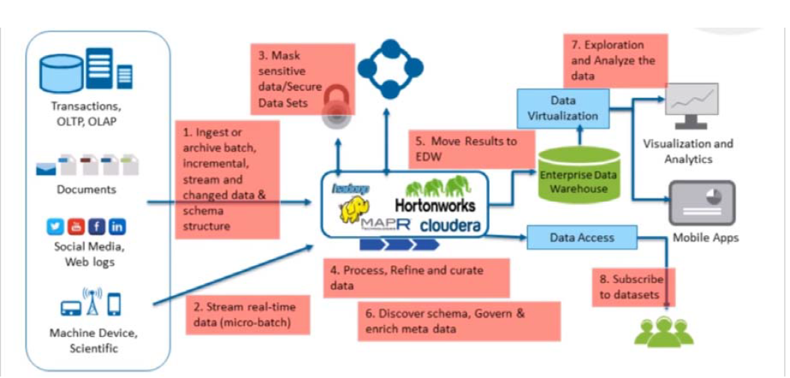

## Data Lake Vs Data Warehouse

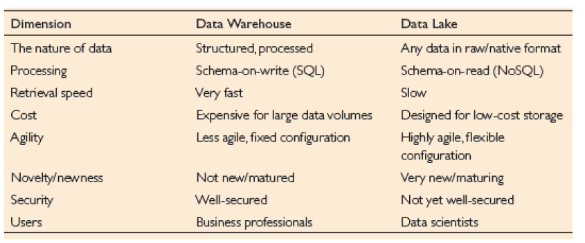
