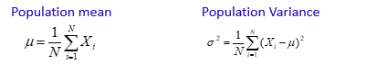
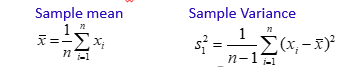
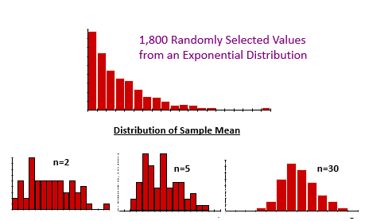
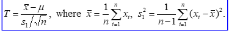
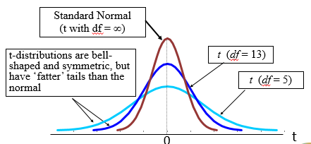

# Sampling Distribution

## Parameter

* Statistical measures computed using population observations.
* Let X1, X2,…, XN are population units.

## Statistic

* Statistical measures computed using sample observations.
* Let x1, x2,…, xn are sample units.

## Sampling Distribution Definition

* Unknown parameters are estimated using sample observations.
* Parameter values are fixed.
* Values of statistic varies sample to sample.
* Each sample has some probability of being chosen.
* Each value of a statistic is associated with a probability.
* Statistic is a random variable.
* Distribution of a statistic is called sampling distribution.
* Distribution of a statistic may not be the same as the distribution of population.

## Central Limit Theorem

* When population distribution is N(μ, σ), then 𝑥 ̅~N(𝜇, 𝜎/√𝑛 )
* When the population distribution is not normal, then also 𝑥 ̅~N(𝜇, 𝜎/√𝑛 ) provided n→∞.
* Practically, this result is true for n ≥ 30.
* This result can also be written as :
𝑍=(𝑥 ̅−𝜇)/(𝜎/√𝑛)~𝑁(0,1)

Put another way, doesn't matter the type of original distribution (Normal, Uniform, Exponenetial etc) if the sample size n >= 30, then we consider that its mean will follow a normal distribution.

## Sampling Proportion Distribution

* Let us consider that the population is divided into two mutually exclusive and collectively exhaustive classes.
* One class possesses a particular attribute, Other class does not posses that attribute.
* For example a people in a city could be divided into “Smokers” and “Non-smokers”.

Let there be a population of any distribution.
N = population size
X = no. of people out of N possessing a particular attribute
𝝅 = Actual proportion of the people possessing a particular attribute = X/N

Let a sample is selected from this population.
n = sample size
x = no. of people in the sample possessing a particular attribute
p =  x/n = sample proportion

When the sample size n is large enough :
**𝑍 = (p − 𝝅)/√(𝝅(1-𝝅)/n)~𝑁(0,1)**

This is a particular case of central limit theorem.

* Practically, this result is true for n ≥ 30. Or, when n𝝅 ≥ 5 as well as   n(1- 𝝅 ) ≥ 5

## Degree of Freedom

* The no. of independent observations which make up a statistic, is known as the degrees of freedom (d.f.) associated with that statistic.
* d.f. is the number of values in the final calculation of a statistic that are free to vary.
* Eg.
    Assume four numbers: a, b, c, and d, such that a+b+c+d = m.
    You are free to choose the any three numbers at random. But 4th  must be chosen so that it makes the total equal to m. Thus your degree of freedom is three.

* In general, d.f. of a statistic = (no. of independent observations)  -  (no.  of parameters estimated)

## Student's t Distribution

Let us take a sample x1, x2, x3,..., xn from N(μ,σ).

Define the statistic

Then T follows Student’s t Distribution with (n-1) d.f. and range (- ∞,∞).

Note: t(n-1) →N(0,1)  as  n  increases

