# Statistical Hypothesis

## The Hypthesis

### Research Hypthesis

A Statement of what the research believes will be the outcome of an experiment or a study.

* Eg.
  * Older workers are more loyal to a company.
  * Companies with more than $1 billion of assets spend a higher percentage of their annual budget on advertising than do companies with less than $1 billion of assets.

### Statistical Hypotheses

A formal structure used to statistically (based on a sample) test the research hypothesis. It can also be though of as a claim (assumption) about a population parameter

* Examples:
  * The average monthly cell phone bill of the people in Lucknow is   Rs. 1000.00
  * The proportion of adults in this city with cell phones is more than 0.80

## Statistical Hypothesis Parts

### Null Hypothesis

* Null Hypthesis refers to the status quo (current or existing state of affairs) i.e. The null condition exists. So, nothing new is happening.
* Denoted as H0
* Similar to the notion of innocent until proven guilty
* Usually a hypothesis of no difference.
    Example:  The average number of TV sets in U.S. Homes is equal to three. H0: μ = 3
* Begin with the assumption that the H0 is true. Then test H0 for rejection or acceptance.

### Alternative Hypothesis

* Alternative challenges the status quo. So, Something new is happening
* Denoted as H1 or Ha
* It is the opposite of the null hypothesis
    E.g., The average number of TV sets in U.S. homes is not equal to 3  ( H1: μ ≠ 3 )
* It is generally the hypothesis that the researcher is trying to prove
* The Null and Alternative Hypotheses are mutually exclusive. So, only one of them can be true.
* Eg. Let's say Company wants to prove it's market share no2 greater than 18%. So,
  * H0 : π = 0.18
  * H1 : π > 0.18

## Errors in Decision Making

  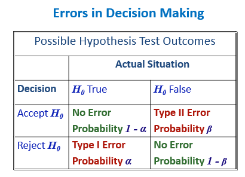

* There are two Types of errors :
  * Type I Error : Reject H0, when it is right.
  * Type II Error : Accept H0, when it is wrong.

* Size of Type I Error : P(Type I Error) = P(Reject H0|H0)
                        = α (Also called Producer's Risk)
* Size of Type II Error : P(Type II Error) = P(Accept H0|H1)
                        = β (Also Called Consumer's Risk)

* α is set by the researcher in advance. This is also called as **Level of Significance**

## Critical Values

Critical value divides the whole area under probability curve into two regions:

### Critical (Rejection) Region

* When the statistical outcome falls into this region, H0 is rejected.
* Size of this region is α.

### Acceptance Region

* When the statistical outcome falls into this region, H0 is accepted.
* Size of this region is (1-α).

#### Two Tail Test

  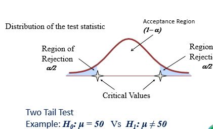

#### Right Tail Test

  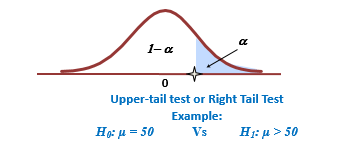

#### Left Tail Test

  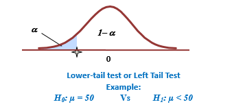

## Hypothesis Testing for μ (First Method)

* **Assumptions**
  * σ is known.
  * Population is normal or sample size is large (n ≥ 30).

* **Test Statistic**
  * Compute the value of test statistic using following formula:

  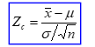

* **Level of Significance**
  * Fix the value of a, say 0.05 or 0.10

* **Critical Values**
  * Distribution of test statistic is N(0,1)
  * Critical values are obtained using N(0,1)

### Decision Making

#### Steps

* State H0 and H1
* Compute the value of test statistic Zc
* Obtain critical value for fixed α and according to H1 (Right/ Left/ Two tailed test)
* Compare computed value of Zc with critical value

#### Make the decision accordingly

* We reject H0 in the favor of H1 at α x 100% level
  * If |Zc| > zα/2 (for two tailed test)
  * If  Zc  > zα   (for right tailed test)
  * If  Zc  < -zα  (for left tailed test)

* Accepting H0 means that
  * The difference between sample mean and hypothetical population mean is not significant. (The difference is because of sampling fluctuation only.)
  * Or, sample has no enough evidence to reject H0.

* Some useful Critical Values of N(0, 1) for comparision

  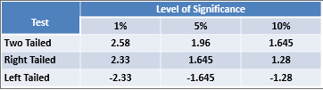

### p-value Approach

* Let Zc be the computed value of test statistic and Let  Z ~ N(0,1)
* Then p – value is given by the following probability
  * For two tailed tests:  2 * P(Z > |Zc|)
  * For right tailed tests: P(Z > Zc)
  * For left tailed tests:  P(Z < Zc)
* Decision: H0 is rejected in the favor of H1 at α x100% level of significance, if **p – value < α**
* The p – value is the smallest level of significance at which H0 would be rejected.

## Hypothesis Testing for μ (Second Method)

* **Assumptions**
  * σ is unknown.
  * sample size is large (n ≥ 30).

* **Test Statistic**
  * Compute the value of test statistic using following formula:

  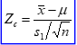

* **Level of Significance**
  * Fix the value of a, say 0.05 or 0.10

* **Critical Values**
  * Distribution of test statistic is N(0,1)
  * Critical values are obtained using N(0,1)

## Hypothesis Testing for μ (Third Method)

* **Assumptions**
  * σ is unknown.
  * Population is normal.
  * sample size is small (n < 30).

* **Test Statistic**
  * Compute the value of test statistic using following formula.
  * Test Statistic Tc has t(n-1) distribution.

  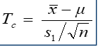

* **Level of Significance**
  * Fix the value of a, say 0.05 or 0.10

* **Critical Values**
  * Critical values of t(n-1) distribution can be obtained from the t table for given d.f. and significance level.

  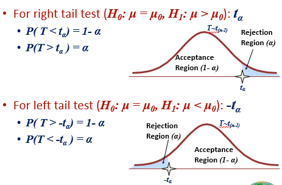

  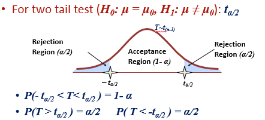

* We reject H0 in the favor of H1 at α x100% level
  * If |Tc| > tα/2 (for two tailed test)
  * If Tc   > tα   (for right tailed test)
  * If Tc   < -tα  (for left tailed test)

### p – value Approach in t Distribution

* Let tc be the computed value of test statistic and Let T ~ t(n-1)
* Then p – value is given by the following probability
  * For two tailed tests: 2P(T > |tc|)
  * For right tailed tests: P(T > tc)
  * For left tailed tests: P(T < tc)
* Decision: H0 is rejected in the favor of H1 at α x100% level of significance, if  **p – value < α**
* In case of t distribution, p – value  may not always be obtained from the table. (Use Excel)

## Summary of Testing Strategy

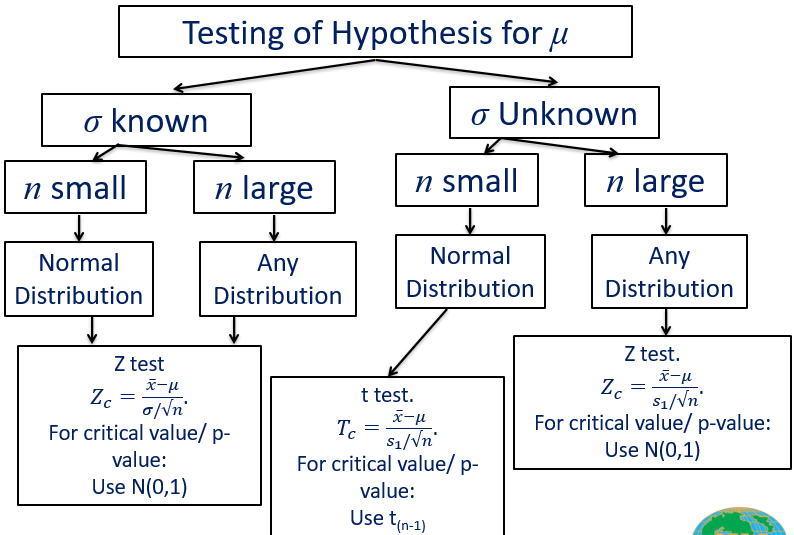

## Hypothesis Testing of Population Proportion

* Suppose, A manufacturer believes that exactly 8% of its products contain at least one minor flaw. The company wants to test this belief.
* A sample of 200 products resulted in 33 items have at least one minor flaw.
* Population is divided into 2 mutually exclusive and exhaustive classes “A” and "Aᶜ"
* 𝝅 = Actual proportion of individuals in class “A”

A sample is selected from this population.

* p =  sample proportion of individuals in class “A”
* We want to test:
  * H0: 𝝅 = 𝝅0, H1: 𝝅 > 𝝅0 (Right or Upper Tail Test)
  * H0: 𝝅 = 𝝅0, H1: 𝝅 < 𝝅0 (Left or Lower Tail Test)
  * H0: 𝝅 = 𝝅0, H1: 𝝅 ≠ 𝝅0 (Two Upper Tail Test)

* **Assumption**
  * Sample is large.
  * n ≥ 30   or   n𝝅 ≥ 5 as well as   n(1-𝝅) ≥ 5
  * Zc ~ N(0,1) So, N(0,1) distribution is used to obtain critical value.

* **Test Statistic**

  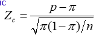

* Decision rules are the same as discussed earlier.
* p – value approach can also be used.
