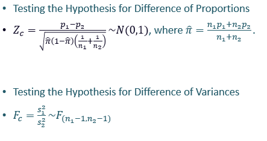

# Statistical Hypothesis

## Hypothesis Testing (Two Samples)

* **Notations**

  

* **To test**
  * H₀: μ₁ = μ₂ H₁: μ₁ ≠ μ₂
  * H₀: μ₁ = μ₂ H₁: μ₁ > μ₂
  * H₀: μ₁ = μ₂ H₁: μ₁ < μ₂

## Testing Strategy

  

### Method 1

* Check assumptions from above Strategy table.
* Use N(0,1) to obtain critical value/ p-value.

### Method 2

* Check assumptions from above Strategy table.
* Use N(0,1) to obtain critical value/ p-value.

### Method 3 (t test for two independent samples assuming equal variances)

* **Assumptions**
  * σ₁ and σ₂ both  are unknown
  * Both populations are normal
  * sample sizes n₁ and n₂ are small
  * Unknown σ₁ and σ₂ are assumed to be equal

* **Test Statistic**

  

* Use t(n₁+n₂-2) distribution for critical value/ p-value.

## Method 4 (t test for two independent samples assuming unequal variances)

* **Assumptions**
  * σ₁ and σ₂ both  are unknown
  * Both populations are normal
  * sample sizes n₁ and n₂ are small
  * Unknown σ₁ and σ₂ are assumed to be unequal

* **Test Statistic**

  

* Use t(f) distribution for critical value/ p-value.

  

## Method 5 (paired)

* **Assumptions**
  * Observations are paired
  * Both populations are normal

* **Test Statistic**

  

* Use t(n-1) distribution for critical value/ p-value.

## Hypothesis Testing for Differences of Variances

* **Notations**

  

* **To test**
  * H₀: σ₁² = σ₂²   H₁: σ₁² ≠  σ₂²
  * H₀: σ₁² = σ₂²   H₁: σ₁² > σ₂²
  * H₀: σ₁² = σ₂²   H₁: σ₁² < σ₂²

* **Assumptions**
  * Both populations are normal

* **Test Statistic**

  

* For critical values, use Snedecor’s F distribution with degree of freedom (n1−1,n2−1).

### Two Tail Test

  

### Right Tail Test

  

### Left Tail Test

  

* The F critical value is found from the F table
* There are two appropriate degrees of freedom: numerator and denominator.
* In the F table,
  * numerator degrees of freedom determine the column (denoted as n₁  or ν1 usually)
  * denominator degrees of freedom determine the row (denoted as n₂  or ν2 usually)
* Also, note that:

  

## Hypothesis Testing for Differences of Proportions

* **Notations**

  

* **To test**
  * H₀: π₁  = π₂ H₁: π₁ ≠ π₂
  * H₀: π₁ = π₂ H₁: π₁ > π₂
  * H₀: π₁ = π₂ H₁: π₁ < π₂

* **Assumptions**
  * Large samples (n₁, n₂ ≥ 30)

* **Test Statistic**

  

* Use N(0,1) to obtain critical value/ p-value.
* In most of the problems, 𝝅 is not known, so we use the estimate of 𝝅, given by :

  

## Summary of Testing Strategies

  

  
