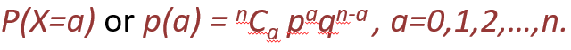
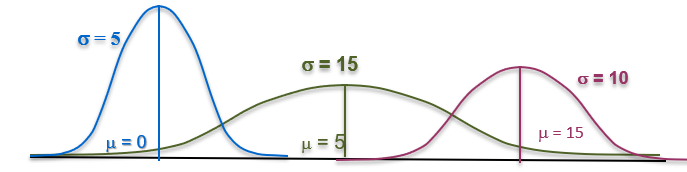
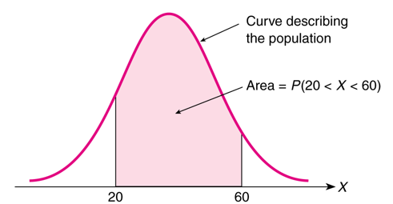
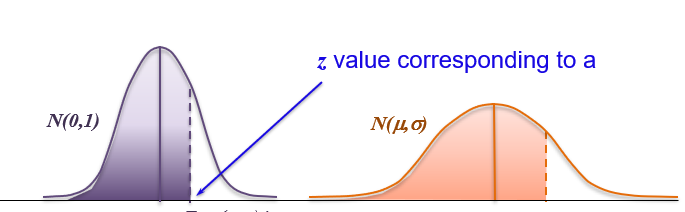

# Random Variable and Distribution

## Random Variable

* A random variable is a numerical measure of the outcomes of an experiment.
* Each value of a random variable is associated with a probability.

Eg.  Consider the random experiment of tossing two coins,

If X is the random variable that counts the number of heads, then the sample space  S = {HH,HT ,TH,TT }

X can take any value out of 0,1 and 2.

P(X =0) = P(TT) = 1/4,
P(X =1) = P(HT ,TH) = 2/4,
P(X =2) = P(HH) = 1/4.

### Types of Random Variables

Random Variables are of two types:

1. **Discrete Random Variable** takes only a countable (finite or countably infinite) number of values.
Eg.

   * No. of accounts opened, no. of cars sold,
   * Friday night attendance at a cinema,
   * no. of defective bulbs in a box etc.

   The range set of a discrete random variable X, Rx = {collection of all possible values of X} is countable.

2. **Continuous Random Variable** takes on any values within an interval.
Eg.

   * Weight of fertilizer packed in a bag.
   * the amount of sugar in an orange,
   * the time required to run a mile,
   * price of a stock etc.

   Continuous random variable is usually a measurement. It can take an uncountably infinite number of values.

   The range set of a continuous random variable X, Rx = {collection of all possible values of X} is an interval.

### Probability Distribution of a Discrete Random Variable

In tossing two coins, if X is the random variable that counts the number of heads, then the probability distribution of X is

| X = x<sub>i</sub> | p<sub>i</sub> |   |
|-------------------|---------------|---|
|                  0|            1/4|   |
|                  1|            2/4|   |
|                  2|            1/4|   |

Probability mass function of X is :

```stats
p(x) = 1/4, if x = 0
       2/4, if x = 1
       1/4, if x = 2
```

### Expectation of a Discrete Random Variable

Expectation of a random variable can be interpreted as “some sort of average” of all the values that the random variable takes.

So, expected value of a random variable is the center of its distribution.

Expectation or Expected value  or mean of a discrete random variable (r.v.)  X is defined as:


For eg. If person gains 100 Rs. if at least one head comes and loses 200 Rs. if no head comes in a random experiment of toss of 2 coins.

Then his expected gain =

```stats
100* (3/4) + (-200)* (1/4)
= 100/4 = 25
```

### Variance of a Discrete Random Variable

The idea of center is not enough to summarize a probability distribution. We also need some idea of dispersion along with that.

Dispersion of a random variable X is measured by Variance. It is the expected squared deviation of  X from its mean.

Variance of random Variable X is given by :


Where, 

p(x) is the probability mass function of X.

**Standard Deviation** of X = σ<sub>x</sub> = √[Var (X)]

Variance and Standard Deviation are always non-negative.

## Distribution

A Distribution provides a distribution in terms of table or graph. Below are the Types of Distributions

### Binomial Distribution

Consider n independent trials of a random experiment having only two outcomes – success with probability p and failure with probability q = 1 − p.

Define a random variable X as the number of Successes in n trials.

Then probability of getting a Successes out of n trials is given by :



Conditioions :

* Sample size or number of trials is finite. Trials are independent.
* You have only two mutually exclusive and exhaustive outcomes - like Success and Failure.
* Probability of Success (p) is constant across all trials.

**Excel Formula:**

```Excel
X = no of successes out of total n trials
X~B(n,p)


P(X=a)  = binom.dist(a,n,p,0)

P(X<=a) = binom.dist(a,n,p,1)
```

### Poisson Distrubtion

When n -> infinity and p -> 0, we may approximate Binomial Distribution by Poisson Distribution.


Where  (lambda) = n*p

Thus, Poisson Distribution is a limiting case of Binomial. Practically, we can consider Poisson When n>20 and p < 0.05,

Eg.
There are 100000 vehicles on the streets of Lucknow
On a given day, probability of a vehicle meeting with an accident is 0.00005.
np = (lambda) = 5 accidents per day (accident rate)

**Excel Formula:**

```Excel
lambda = "rate" = n * p
X~Possion(lambda)

P(X=a)  = possion.dist(a,lambda,0)
P(X<=a) = possion.dist(a,lambda,1)
```

### Comparision between Binomial and Poisson Distribution

* The Poisson distribution and Binomial Distribution have some similarities, but also several differences.
  * Binomial Distribution describes a distribution of two possible outcomes – Success and Failure.
  * Poisson Distribution focuses only on the number of discrete occurrences over some interval.
  * A Poisson experiment does not have a given number of trials (n) as a binomial  experiment does.
  * The Poisson describes the occurrence of rare events. E.g., no. of serious accidents at a chemical plant per month.
  * If the occurrences are too frequent, the time interval can be reduced enough so that the occurrences are rare.

#### Other Applications of Poisson

* No. of suicides reported in a particular city
* No. of defective items in a packing manufactured
* No. of air accidents in some duration of time

### Normal Distribution

Normal Distribution is known by its bell Curve. Most of the characteristics follow normal distribution in real life, provided the data is sufficiently large.

The mean and standard deviation define the characterstic of the Normal distrubtion.



* The Probability is defined by the area under the curve.



* Point Probility is 0 in Normal ditribution. Eg. P(X=20) = 0.
* So it means in Normal Distribution:
  * P(a<X<b) = P(a<X<=b) = P(a<=X<b) = P(a<=X<=b)
  * P(X>=5)= 1-P(X<5)= 1-P(X<=5) (this was not the same way in binomial or poisson)

**Excel Formula:**

```Excel
P(X<=k)= norm.dist(k,mu,sigma,TRUE) = norm.dist(k,mu,sigma,1)

P(X=K) = norm.dist(k,mu,sigma,FALSE) = norm.dist(k,mu,sigma,0)
       = 0 (always. hence doesn't make any sense to calculate)

k = norm.inv(p, mu, sigma) # To calculate k if probability given.
```

**R Formula:**

```R
k = qnorm(p,mu,sigma)
```


### Using Printed table to obtain Normal Probabilities

When mean is 0 and standard deviation is 1 the area under the curve, can be obtained using normal table. Hence, for known x, you can obtain P(X<=x) i.e. the area of shaded region, from the Normal table.

```Stats
Given  X ~ N(𝝁, 𝝈),
Define  Z = (𝑿−𝝁)/𝝈. Then Z ~ N(0, 1)

𝑃(𝑋≤𝑎)=𝑃((𝑋−𝜇)/𝜎 ≤ (𝑎−𝜇)/𝜎) = 𝑃(𝑍≤(𝑎−𝜇)/𝜎) = 𝐹((𝑎−𝜇)/𝜎)
```

Table of F(z) = P(Z <= z) are available.



